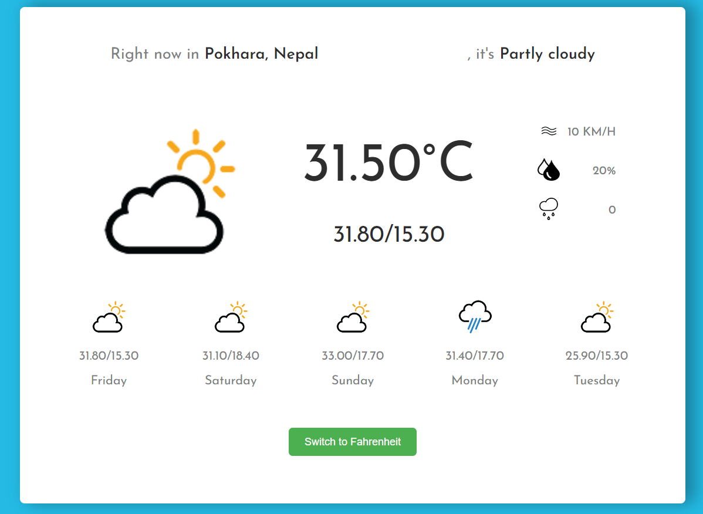

### Final Output

This is the reference image of output

### Weather App

## Description

This weather app provides real-time weather information for a given location. It displays current weather conditions, temperature, humidity, wind speed, and also display a forecast of 5 days.

### Features

- **Current Weather:** Get the current weather conditions for any location.
- **Forecast:** View the weather forecast for the next few days.
- **Location-based:** Automatically detects your location or allows you to search for any location worldwide.
- **User-friendly Interface:** Simple and intuitive design for easy navigation.

### Technologies Used

- Programming Languages: HTML, CSS, JavaScript
- Framework/Libraries: React js

- Design:https://www.figma.com/file/ABw7Mw53SCFJm1gONquWNz/weather-app?type=design&node-id=0%3A1&mode=design&t=tYoyOPdCVyNCxGGY-1

- Weather API: https://open-meteo.com/en/docs/#latitude=28&longitude=84&timezone=auto

- Geolocation API : https://apidocs.geoapify.com/docs/geocoding/forward-geocoding/#code-samples
